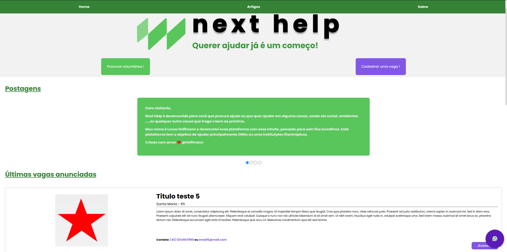
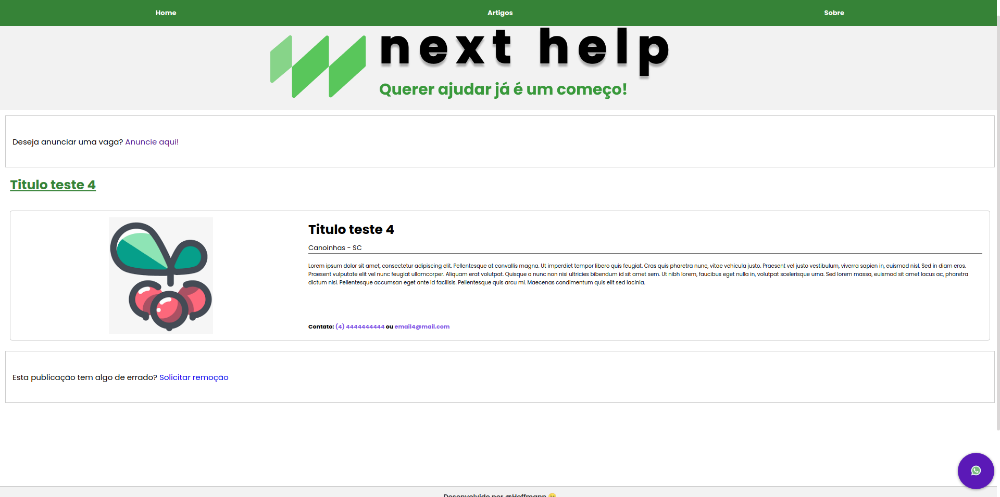
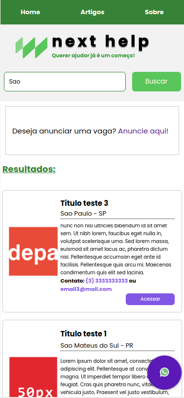

<h1 align="center">
 
  
 
 
</h1>

next help - plataforma de anúncios de vagas para serviços comunitários ! 

 
 

<strong>next help - por Hoffmann</strong>

 
<h2>Responsive Layout</h2>

  
  

 
<h2>Mobile</h2>

  

## Features
- ✅ **Buscar por vagas**
- ✅ **Anunciar vagas**
- ✅ **Entrar em contato com os anunciantes**
- 👨‍💻 **Em desenvolvimento ! **

## Features Futuras
- 👉🏻 Sistema de Login
- 👉🏻 Deletar e atualizar um advert
- 👉🏻 Adcionar anúncios de maior referência na home na area de highlight posts.
- 👉🏻 Curtir e comentar post
- 👉🏻 Chat de conversa interna na plataforma
- 👉🏻 Implantar o framework React com Mongo DB.

## Run
> Example: **127.0.0.1:3035/** or **localhost:3035**

- **Install the dependencies `npm i`**
- **At the terminal start `npm start`** or `npm run dev`

